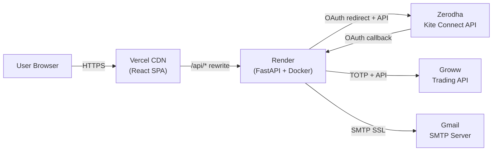
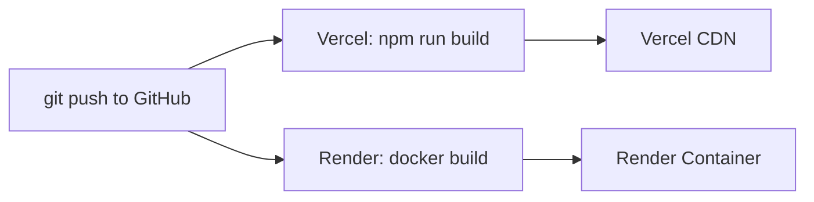
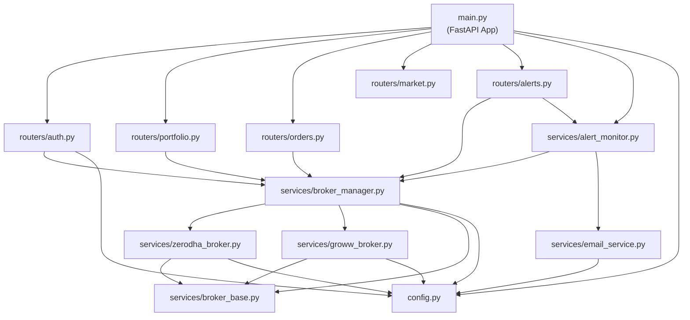
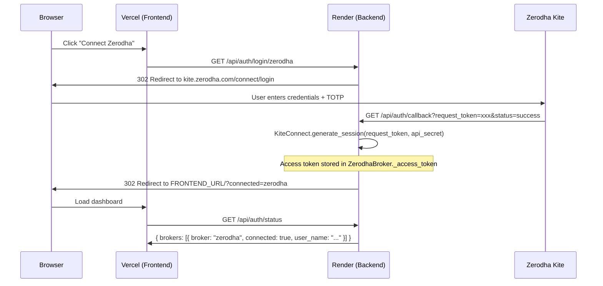
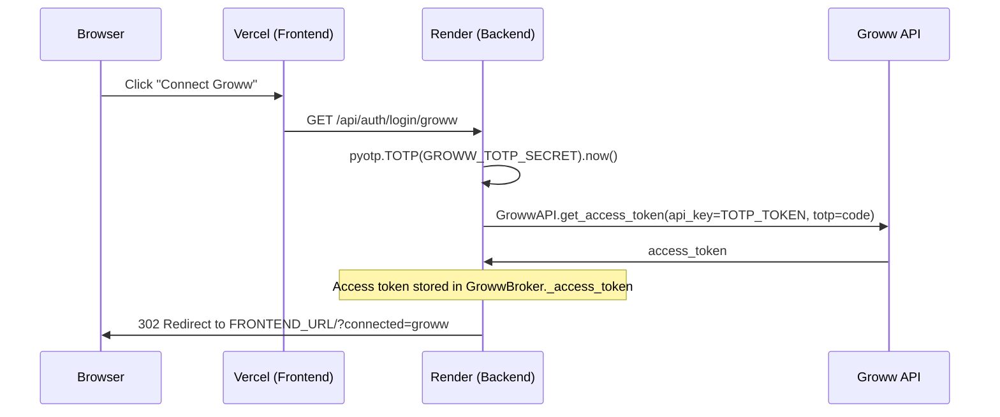
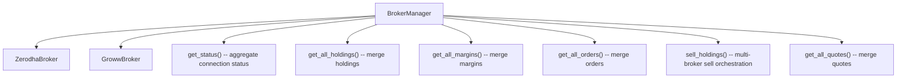
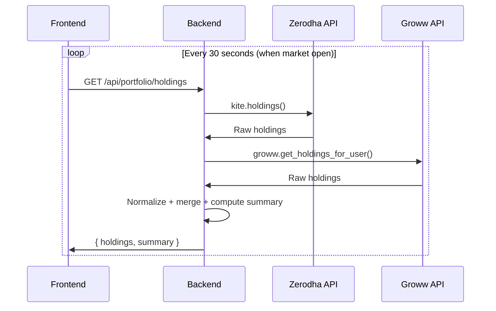
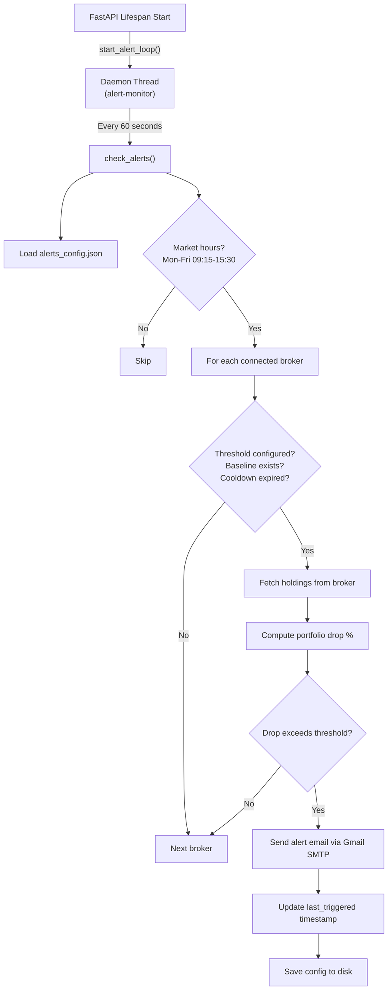
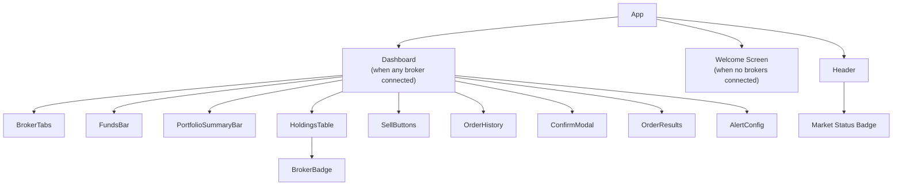

# PanicSell -- Technical Architecture Document

**Version**: 2.0.0
**Date**: March 2026
**Author**: Anindya G.

---

## Table of Contents

1. [Project Overview](#1-project-overview)
2. [System Architecture](#2-system-architecture)
3. [Deployment Infrastructure](#3-deployment-infrastructure)
4. [Backend Architecture](#4-backend-architecture)
5. [API Reference](#5-api-reference)
6. [Authentication and Session Management](#6-authentication-and-session-management)
7. [Broker Abstraction Layer](#7-broker-abstraction-layer)
8. [Data Architecture](#8-data-architecture)
9. [Market Hours and AMO Logic](#9-market-hours-and-amo-logic)
10. [Alert and Notification System](#10-alert-and-notification-system)
11. [Frontend Architecture](#11-frontend-architecture)
12. [Security Considerations](#12-security-considerations)
13. [Limitations and Future Considerations](#13-limitations-and-future-considerations)

---

## 1. Project Overview

PanicSell is a single-user, multi-broker stock liquidation tool built for the Indian equity market. It provides a unified dashboard to view holdings from Zerodha and Groww, and execute sell orders instantly -- individually, per-broker, or across all connected brokers simultaneously.

### Purpose

During market panic events, manually selling stocks across multiple broker apps is slow and error-prone. PanicSell consolidates this into a single interface with one-click sell capabilities, AMO (After Market Order) support, and automated portfolio drop alerts.

### Scope

- Personal-use tool (single user, single backend instance)
- Read-only data access (holdings, margins, orders, quotes) and sell-order execution
- No buy orders, no algorithmic trading, no multi-user tenancy
- Compliant with SEBI 2025 regulations for personal automated trading

### Tech Stack

| Layer | Technology |
|-------|------------|
| Frontend | React 18, TypeScript, Vite 6, Tailwind CSS 3 |
| Backend | Python 3.12, FastAPI, Uvicorn |
| Broker SDKs | `kiteconnect` (Zerodha), `growwapi` (Groww), `pyotp` (TOTP) |
| Email | Gmail SMTP via `smtplib` (SSL, port 465) |
| Container | Docker (`python:3.12-slim`) |
| Frontend Hosting | Vercel (static CDN + API rewrites) |
| Backend Hosting | Render (persistent Docker container) |

---

## 2. System Architecture

### High-Level Topology



### Separation of Concerns

The system is split into two independently deployed services:

- **Vercel (Frontend)**: Serves the static React SPA from a global CDN. All `/api/*` requests are rewritten at the edge to the Render backend. No server-side logic, no environment variables, no state.

- **Render (Backend)**: Runs a persistent Docker container with the FastAPI application. Holds in-memory broker sessions, runs background alert monitoring, and communicates with broker APIs and Gmail SMTP.

The frontend never communicates directly with broker APIs. All broker interactions are proxied through the backend, which holds the access tokens.

---

## 3. Deployment Infrastructure

### Frontend -- Vercel

| Property | Value |
|----------|-------|
| Platform | Vercel |
| Framework | Vite (auto-detected) |
| Build Command | `npm run build` |
| Output Directory | `dist/` |
| Root Directory | `frontend/` |
| URL | `https://panicsell-nine.vercel.app` |

**API Proxy** -- configured in `frontend/vercel.json`:

```json
{
  "rewrites": [
    {
      "source": "/api/:path*",
      "destination": "https://panicsell-backend.onrender.com/api/:path*"
    }
  ]
}
```

All requests matching `/api/*` are rewritten to the Render backend at the edge. The browser sees same-origin requests, avoiding CORS issues on the client side.

### Backend -- Render

| Property | Value |
|----------|-------|
| Platform | Render |
| Service Type | Web Service (Docker) |
| Instance | Free tier (sleeps after 15 min inactivity) |
| Root Directory | `backend/` |
| URL | `https://panicsell-backend.onrender.com` |
| Port | Injected via `$PORT` env var (default: 10000 on Render) |

**Dockerfile** (`backend/Dockerfile`):

```dockerfile
FROM python:3.12-slim
WORKDIR /app
RUN apt-get update && apt-get install -y --no-install-recommends gcc && rm -rf /var/lib/apt/lists/*
COPY requirements.txt .
RUN pip install --no-cache-dir -r requirements.txt
COPY . .
CMD uvicorn app.main:app --host 0.0.0.0 --port ${PORT:-8000}
```

The `gcc` package is required for compiling C extensions in `kiteconnect` and `growwapi`.

**Build exclusions** (`.dockerignore`): `venv/`, `__pycache__/`, `*.pyc`, `.env`, `.git/`

### Environment Variables (Render Dashboard)

| Variable | Purpose | Required |
|----------|---------|----------|
| `KITE_API_KEY` | Zerodha Kite Connect API key | Yes (for Zerodha) |
| `KITE_API_SECRET` | Zerodha Kite Connect API secret | Yes (for Zerodha) |
| `GROWW_TOTP_TOKEN` | Groww TOTP token for auto-login | Recommended |
| `GROWW_TOTP_SECRET` | Groww TOTP secret for code generation | Recommended |
| `GROWW_API_KEY` | Groww API key (fallback auth) | Optional |
| `GROWW_API_SECRET` | Groww API secret (fallback auth) | Optional |
| `FRONTEND_URL` | Vercel frontend origin for CORS | Yes |
| `BACKEND_URL` | Render backend URL for callback construction | Yes |
| `SMTP_EMAIL` | Gmail address for alert emails | Optional |
| `SMTP_APP_PASSWORD` | Gmail app password for SMTP auth | Optional |

No secrets are stored in code or committed to version control. The `.env` file is listed in both `.gitignore` and `.dockerignore`.

### Auto-Deploy Pipeline



Both Vercel and Render are connected to the same GitHub repository and trigger automatic deployments on every push to the main branch.

---

## 4. Backend Architecture

### Directory Structure

```
backend/
  app/
    __init__.py
    main.py              # FastAPI app, middleware, lifespan
    config.py            # Pydantic settings, env loading
    routers/
      __init__.py
      auth.py            # Login, callback, status, logout
      portfolio.py       # Holdings, margins, quotes
      orders.py          # Panic sell, order history
      market.py          # NSE market status
      alerts.py          # Alert config, baseline management
    services/
      __init__.py
      broker_base.py     # Abstract broker interface
      zerodha_broker.py  # Zerodha/Kite implementation
      groww_broker.py    # Groww implementation
      broker_manager.py  # Multi-broker orchestration
      email_service.py   # Gmail SMTP email sending
      alert_monitor.py   # Background alert loop
  requirements.txt
  Dockerfile
  .dockerignore
  .env.example
```

### Module Dependency Graph



### Application Lifecycle

The FastAPI app uses an async context manager for lifespan events:

```python
@asynccontextmanager
async def lifespan(app: FastAPI):
    start_alert_loop()   # spawns background daemon thread
    yield                 # app runs
    # no explicit shutdown; daemon thread dies with process
```

### CORS Configuration

```python
allowed_origins = [settings.frontend_url]
if settings.frontend_url != "http://localhost:5173":
    allowed_origins.append("http://localhost:5173")

app.add_middleware(
    CORSMiddleware,
    allow_origins=allowed_origins,
    allow_credentials=True,
    allow_methods=["*"],
    allow_headers=["*"],
)
```

In production, `allowed_origins` contains the Vercel domain. Localhost is additionally allowed to support concurrent local development. Note that Vercel rewrites bypass CORS entirely since the browser sees same-origin `/api` requests, but the CORS policy is still enforced for direct backend access.

---

## 5. API Reference

All endpoints are prefixed with `/api`. The backend exposes 5 router groups with 14 total endpoints.

### Auth (`/api/auth`)

| Method | Path | Description | Auth Required |
|--------|------|-------------|---------------|
| GET | `/login/{broker_name}` | Initiates broker login. For Zerodha: redirects to Kite OAuth. For Groww: generates session server-side via TOTP and redirects to frontend. | No |
| GET | `/callback/{broker_name}` | OAuth callback. Receives `request_token` and `status` query params, exchanges for access token, redirects to frontend. | No |
| GET | `/callback` | Fallback callback (assumes Zerodha). Handles legacy redirect URLs without broker name. | No |
| GET | `/status` | Returns connection status of all configured brokers, including profile info for connected ones. | No |
| POST | `/logout/{broker_name}` | Disconnects a specific broker. Invalidates Zerodha token server-side; clears Groww session in memory. | No |

### Portfolio (`/api/portfolio`)

| Method | Path | Query Params | Description |
|--------|------|-------------|-------------|
| GET | `/holdings` | `broker` (optional) | Returns holdings from one or all connected brokers, plus a computed summary (total invested, current value, P&L, stock count). |
| GET | `/margins` | -- | Returns per-broker margins/funds and a combined total. |
| GET | `/quotes` | -- | Returns latest LTP quotes for all holdings across all connected brokers. |

**Holdings Response Shape:**

```json
{
  "holdings": [
    {
      "tradingsymbol": "RELIANCE",
      "exchange": "NSE",
      "isin": "INE002A01018",
      "quantity": 5,
      "t1_quantity": 0,
      "total_quantity": 5,
      "average_price": 2450.00,
      "last_price": 2480.50,
      "pnl": 152.50,
      "pnl_percentage": 1.24,
      "day_change": 15.30,
      "day_change_percentage": 0.62,
      "product": "CNC",
      "is_t1": false,
      "broker": "zerodha"
    }
  ],
  "summary": {
    "total_invested": 12250.00,
    "total_current": 12402.50,
    "total_pnl": 152.50,
    "total_pnl_percentage": 1.24,
    "stock_count": 1
  }
}
```

### Orders (`/api/orders`)

| Method | Path | Body / Params | Description |
|--------|------|---------------|-------------|
| POST | `/panic-sell` | `{ symbols?: string[], broker?: string, variety: "regular" \| "amo" }` | Places sell orders. `symbols=null` sells all holdings. `broker=null` sells across all brokers. Returns per-order results with success/failure status. |
| GET | `/history` | `broker` (optional) | Returns today's order history, sorted by placed time (newest first). |

**Sell Response Shape:**

```json
{
  "results": [
    {
      "tradingsymbol": "RELIANCE",
      "quantity": 5,
      "order_id": "2403120001234",
      "status": "success",
      "error": null,
      "broker": "zerodha"
    }
  ],
  "summary": { "total": 1, "success": 1, "failed": 0 }
}
```

### Market (`/api/market`)

| Method | Path | Description |
|--------|------|-------------|
| GET | `/status` | Returns NSE market status: open/closed/pre_open/post_close, AMO eligibility, current IST time, and reason. |

### Alerts (`/api/alerts`)

| Method | Path | Body | Description |
|--------|------|------|-------------|
| GET | `/config` | -- | Returns current alert configuration (enabled, email, thresholds, baselines, cooldowns). |
| POST | `/config` | `{ enabled: bool, email: string, thresholds: { broker: pct } }` | Updates alert config. When enabled, snapshots current portfolio values as baselines. |
| POST | `/reset-baseline` | -- | Re-snapshots current portfolio values as new baselines without changing other settings. |

---

## 6. Authentication and Session Management

### Zerodha -- OAuth 2.0 Flow



The Zerodha redirect URL on their developer console must point to `BACKEND_URL/api/auth/callback` (the fallback route that assumes Zerodha).

### Groww -- TOTP Flow (Recommended)



No browser interaction with Groww is required. The TOTP code is generated server-side using the `pyotp` library, making the connection fully automatic with no daily manual approval.

### Groww -- API Key+Secret Flow (Fallback)

If TOTP credentials are not configured, the backend falls back to:

```python
GrowwAPI.get_access_token(api_key=GROWW_API_KEY, secret=GROWW_API_SECRET)
```

This flow works identically from the user's perspective, but requires daily manual approval on Groww's Cloud API Keys dashboard page.

### Session Storage

Sessions are stored **entirely in memory** on the backend process:

| Broker | Token Location | Persistence |
|--------|----------------|-------------|
| Zerodha | `ZerodhaBroker._access_token` + `KiteConnect._access_token` | Lost on process restart |
| Groww | `GrowwBroker._access_token` + `GrowwAPI` instance | Lost on process restart |

There is no database, no Redis, and no cookie/JWT mechanism. The `BrokerManager` is instantiated as a module-level singleton (`broker_manager = BrokerManager()`) and lives for the lifetime of the process.

**Token expiry**: Both Zerodha and Groww tokens expire daily (around 6-8 AM IST). Users must reconnect each morning.

### Logout

- **Zerodha**: Calls `KiteConnect.invalidate_access_token()` to invalidate the token on Zerodha's servers, then clears local state.
- **Groww**: Clears in-memory state only (no server-side invalidation API available).

---

## 7. Broker Abstraction Layer

### Abstract Interface

`backend/app/services/broker_base.py` defines the contract all broker implementations must satisfy:

| Method | Signature | Return | Purpose |
|--------|-----------|--------|---------|
| `is_connected` | `@property -> bool` | `bool` | Whether the broker has an active session |
| `get_login_url` | `() -> str` | URL or `""` | OAuth redirect URL, or empty for non-OAuth brokers |
| `generate_session` | `(request_token: str) -> dict` | Token dict | Exchange request token (or generate via TOTP) for access token |
| `get_holdings` | `() -> list[dict]` | Normalized holdings | All current holdings with prices and P&L |
| `place_sell_order` | `(tradingsymbol, exchange, quantity, product, variety) -> str` | Order ID | Place a market sell order |
| `get_margins` | `() -> dict` | Margin info | Available cash and used margin |
| `get_orders` | `() -> list[dict]` | Order history | Today's executed and pending orders |
| `get_profile` | `() -> dict` | User info | User name and ID |
| `get_quotes` | `(instruments: list[str]) -> dict` | LTP quotes | Latest prices for given symbols |
| `logout` | `() -> None` | -- | Clear session and invalidate tokens |

### Implementations

**ZerodhaBroker** (`zerodha_broker.py`):
- Wraps the `KiteConnect` SDK from `kiteconnect` package
- Holdings normalization: maps Kite's response to common schema, computes `total_quantity = quantity + t1_quantity`, flags `is_t1` holdings
- Sell orders: uses `VARIETY_REGULAR` or `VARIETY_AMO`, `ORDER_TYPE_MARKET`, `TRANSACTION_TYPE_SELL`
- Quotes: fetches via `kite.ltp()` for `NSE:{symbol}` instruments

**GrowwBroker** (`groww_broker.py`):
- Wraps the `GrowwAPI` class from `growwapi` package
- Holdings normalization: fetches LTP per-symbol via `groww.get_ltp()`, computes P&L
- Sell orders: uses `GrowwAPI.place_order()` with `TRANSACTION_TYPE_SELL`, `ORDER_TYPE_MARKET`, `PRODUCT_CNC`
- Exchange mapping: converts `"NSE"` / `"BSE"` strings to `GrowwAPI.EXCHANGE_NSE` / `GrowwAPI.EXCHANGE_BSE`
- Order status mapping: normalizes Groww statuses (`EXECUTED` -> `COMPLETE`, `ACKED` -> `OPEN`, etc.)

### BrokerManager

`broker_manager.py` is the central orchestration layer:



**Multi-broker sell orchestration** (`sell_holdings`):
1. Determine target brokers (specific or all connected)
2. For each broker, fetch holdings
3. Filter to sellable holdings (`total_quantity > 0`)
4. If specific symbols requested, filter further
5. Place sell orders sequentially, collecting results
6. Return aggregated results with per-order success/failure

### Adding a New Broker

To add a new broker (e.g., Angel One):

1. Create `backend/app/services/angelone_broker.py` implementing `BrokerBase`
2. Add credentials to `config.py` (e.g., `angelone_api_key`)
3. Register in `BrokerManager.__init__()` conditionally on credentials
4. No changes needed to routers, frontend hooks, or types -- the abstraction handles it

---

## 8. Data Architecture

### Storage Model

PanicSell uses **no database**. All data falls into three categories:

| Data Type | Storage | Lifetime | Location |
|-----------|---------|----------|----------|
| Broker access tokens | In-memory (Python objects) | Until process restart | `ZerodhaBroker._access_token`, `GrowwBroker._access_token` |
| Alert configuration | JSON file on disk | Persistent across restarts | `backend/alerts_config.json` |
| Holdings, orders, margins, quotes | None (fetched in real-time) | Per-request | Broker APIs |

### Alert Configuration File

`backend/alerts_config.json` (created on first alert config save):

```json
{
  "enabled": true,
  "email": "user@gmail.com",
  "thresholds": {
    "zerodha": -5.0,
    "groww": -3.0
  },
  "baselines": {
    "zerodha": 125000.00,
    "groww": 48000.00
  },
  "last_triggered": {
    "zerodha": 1710234567.89
  }
}
```

### Data Normalization

Both broker SDKs return data in different formats. The broker implementations normalize everything to a common schema before returning to the routers:

**Holding (normalized)**:

| Field | Type | Source (Zerodha) | Source (Groww) |
|-------|------|------------------|----------------|
| `tradingsymbol` | `string` | `tradingsymbol` | `trading_symbol` |
| `exchange` | `string` | `exchange` | `"NSE"` (default) |
| `quantity` | `int` | `quantity` | `quantity` |
| `t1_quantity` | `int` | `t1_quantity` | `t1_quantity` |
| `total_quantity` | `int` | Computed | Computed |
| `average_price` | `float` | `average_price` | `average_price` |
| `last_price` | `float` | `last_price` | Via `get_ltp()` |
| `pnl` | `float` | `pnl` | Computed |
| `day_change` | `float` | `day_change` | `0` (limited API) |
| `broker` | `string` | `"zerodha"` | `"groww"` |

### Real-Time Data Flow



---

## 9. Market Hours and AMO Logic

### NSE Market Timing

The market status engine (`backend/app/routers/market.py`) uses IST (Asia/Kolkata) timezone and defines these sessions:

| Session | Time (IST) | Status | AMO Allowed |
|---------|-----------|--------|-------------|
| Before pre-open | 00:00 -- 09:00 | `closed` | Yes |
| Pre-open auction | 09:00 -- 09:15 | `pre_open` | No |
| Continuous trading | 09:15 -- 15:30 | `open` | No |
| Post-close | 15:30 -- 15:40 | `post_close` | No |
| After hours | 15:40 -- 24:00 | `closed` | Yes |
| Weekends | All day | `closed` | Yes |
| NSE holidays | All day | `closed` | Yes |

### Holiday Calendar

NSE holidays for 2026 are hardcoded in `NSE_HOLIDAYS_2026`:

```python
NSE_HOLIDAYS_2026 = {
    "2026-01-26", "2026-03-10", "2026-03-17", "2026-03-30",
    "2026-04-01", "2026-04-03", "2026-04-14", "2026-05-01",
    "2026-05-25", "2026-07-07", "2026-08-15", "2026-08-26",
    "2026-10-02", "2026-10-20", "2026-10-22", "2026-11-04",
    "2026-11-09", "2026-12-25",
}
```

This must be updated annually with NSE's published holiday calendar.

### AMO (After Market Order) Logic

AMO orders are allowed when the market status is `closed` and the current time is outside the pre-open to post-close window (i.e., before 09:00 or after 15:40). The frontend reads `allows_amo` from the market status response and adjusts the sell buttons accordingly:

- During market hours: regular sell orders
- Outside market hours (AMO eligible): sell buttons switch to AMO mode
- During pre-open/post-close: selling is disabled (neither regular nor AMO)

### Frontend Polling

The `usePolling` hook refreshes holdings every 30 seconds, but only when:
- At least one broker is connected (`anyConnected === true`)
- The market is open (`marketStatus.is_open === true`)

When the market closes, polling stops automatically to avoid unnecessary API calls.

---

## 10. Alert and Notification System

### Architecture



### Per-Broker Threshold Checking

Alerts operate at the **per-broker level**, not across the combined portfolio. Each broker has:
- An independent drop threshold (e.g., Zerodha: -5%, Groww: -3%)
- A baseline value (snapshot of portfolio value when alerts were enabled)
- An independent cooldown timer (1 hour between alerts for the same broker)

### Cooldown Mechanism

After sending an alert for a broker, the system records `time.time()` in `last_triggered[broker_name]`. Subsequent checks skip that broker until `COOLDOWN_SECONDS` (3600 = 1 hour) have elapsed.

### Email Delivery

Emails are sent via Gmail's SMTP server using SSL on port 465:

```python
with smtplib.SMTP_SSL("smtp.gmail.com", 465) as server:
    server.login(smtp_email, smtp_app_password)
    server.send_message(msg)
```

**Email content includes**:
- Broker name and drop percentage
- Current portfolio value vs. baseline
- Drop amount in INR
- Top 3 losers by daily P&L
- Top 3 gainers by daily P&L

The `SMTP_EMAIL` must be a Gmail address, and `SMTP_APP_PASSWORD` must be a Gmail App Password (not the account password), generated from Google Account security settings.

---

## 11. Frontend Architecture

### Component Hierarchy



### Custom Hooks

| Hook | API Call | Polling | Purpose |
|------|----------|---------|---------|
| `useAuth` | `GET /api/auth/status` | On mount + after login/logout | Broker connection status |
| `usePortfolio` | `GET /api/portfolio/holdings` | Via `usePolling` | Holdings and summary data |
| `usePanicSell` | `POST /api/orders/panic-sell` | None | Execute sell orders |
| `useMarketStatus` | `GET /api/market/status` | Every 30s | Market open/closed status |
| `usePolling` | Calls `fetchHoldings` | Every 30s (when market open + connected) | Auto-refresh mechanism |

### State Management

The application uses **React local state and hooks only** -- no Redux, Zustand, or other external state libraries.

| State | Location | Scope |
|-------|----------|-------|
| Broker statuses | `useAuth` → `App` | Global |
| Holdings + summary | `usePortfolio` → `App` | Global |
| Selected holdings | `useState` in `App` | Dashboard |
| Broker filter tab | `useState` in `App` | Dashboard |
| Sell results | `usePanicSell` → `App` | Dashboard |
| Market status | `useMarketStatus` → `App` | Global |
| Modal state | `useState` in `App` | Dashboard |

Filtered views (per-broker holdings, per-broker summary) are computed via `useMemo` based on the active broker filter tab.

### API Communication

All API calls use the browser's native `fetch` API with relative `/api/` paths:

```typescript
const res = await fetch("/api/portfolio/holdings");
const data: HoldingsResponse = await res.json();
```

- **Development**: Vite dev server proxies `/api/*` to `http://localhost:8000`
- **Production**: Vercel rewrites `/api/*` to the Render backend at the edge

No HTTP client library (Axios, etc.) is used.

### UI Design System

| Element | Implementation |
|---------|---------------|
| Background | `surface-0` (#06060a) with SVG fractal noise overlay |
| Cards | Glassmorphism: `rgba(12,12,20,0.6)` + `backdrop-blur(20px)` + subtle borders |
| Fonts | Outfit (headings/body), JetBrains Mono (numbers/data) |
| Colors | Zerodha: `#387ed1`, Groww: `#00d09c`, Danger: `#ff3b5c`, Profit: `#00d68f` |
| Animations | `fade-in-up` (entrance), `scale-in` (modals), `glow-pulse` (panic button), `float` (decorative) |
| Stagger | `.stagger-1` through `.stagger-6` for sequential entrance animations |

---

## 12. Security Considerations

### Transport Security

- **HTTPS**: Enforced by both Vercel and Render at the edge. All traffic between the browser and both services is encrypted via TLS.
- **SMTP**: Uses SSL (port 465) for email delivery to Gmail.

### CORS Policy

The backend restricts cross-origin requests to the configured `FRONTEND_URL`. In production, only the Vercel domain is allowed. Note that Vercel's rewrite proxy means most `/api` requests appear as same-origin to the browser, so CORS headers are primarily relevant for direct backend access.

### Secrets Management

| Secret | Storage | Access |
|--------|---------|--------|
| Broker API keys/secrets | Render env vars | Server-side only |
| TOTP secrets | Render env vars | Server-side only |
| SMTP credentials | Render env vars | Server-side only |
| Broker access tokens | In-memory (Python) | Never sent to frontend |

- `.env` is excluded from git (`.gitignore`) and Docker builds (`.dockerignore`)
- No secrets are embedded in frontend code
- Broker access tokens are never exposed to the client -- the frontend only receives a `connected: true/false` status

### Session Security

- **No JWT, no cookies**: Sessions are server-side only, stored as Python object attributes. There is no session token sent to the client.
- **No session hijacking surface**: Since no session identifier is transmitted, there is nothing for an attacker to steal from the client side.
- **Trade-off**: The backend must be a single process (no horizontal scaling), and sessions are lost on restart.

### Input Validation

- `variety` parameter is validated against `("regular", "amo")`
- Broker names are validated via `BrokerManager.get_broker()` which raises `ValueError` for unknown brokers
- `SellRequest` uses Pydantic model validation
- `AlertConfigRequest` uses Pydantic model validation

### Rate Limiting

There is no rate limiting middleware. This is acceptable for a single-user tool but would need to be addressed for multi-user deployment.

### SEBI Compliance

PanicSell is designed as a personal trading tool that complies with SEBI 2025 regulations:
- Uses only official broker APIs (Kite Connect, Groww Trade API)
- Does not engage in algorithmic trading or automated order placement without user initiation
- Every sell action requires explicit user confirmation via a typed challenge in the confirmation modal
- No third-party access to broker credentials

---

## 13. Limitations and Future Considerations

### Current Limitations

| Limitation | Impact | Mitigation |
|-----------|--------|------------|
| Single-user architecture | Only one user per backend instance | Acceptable for personal use |
| No database | Alert config is the only persistent data; sessions lost on restart | Users re-authenticate daily anyway (token expiry) |
| Render free tier cold starts | First request after 15 min inactivity takes ~30 seconds | Acceptable for personal use; upgrade to paid tier ($7/mo) eliminates this |
| Hardcoded holiday calendar | Must be updated annually | Update `NSE_HOLIDAYS_2026` in `market.py` before 2027 |
| No buy orders | Sell-only tool | By design -- scope limited to liquidation |
| Groww day change data | Limited to 0 (API doesn't expose intraday change) | Would require additional quote API integration |
| No LLM integration | No AI-powered features | N/A for current scope |

### Future Improvements

| Improvement | Benefit |
|-------------|---------|
| **Redis for sessions** | Survive process restarts, enable horizontal scaling |
| **PostgreSQL for audit logs** | Persistent order history, portfolio snapshots over time |
| **Multi-user auth (JWT + database)** | Support multiple users on a single deployment |
| **Additional brokers** (Angel One, Upstox) | Broader market coverage via the existing abstraction layer |
| **WebSocket price streaming** | Real-time price updates instead of 30-second polling |
| **Dynamic holiday calendar** | Fetch NSE holidays from an API instead of hardcoding |
| **Portfolio analytics** | Historical P&L charts, sector allocation, risk metrics |
| **Mobile-responsive UI** | Better experience on phone screens during market panics |

---

*This document reflects the PanicSell architecture as deployed in March 2026. For the latest code, see the [GitHub repository](https://github.com/anindya1046-5887/panicsell).*
